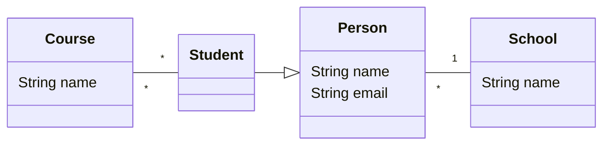

# Polyglot OOP

Simple OOP demonstration in multiple languages.

## Data model

The data model is defined in the class diagram below.

## How to run

To run each example, run `make` in the directory of the language you want to run.
For languages that require a build step, the build step is run automatically.
